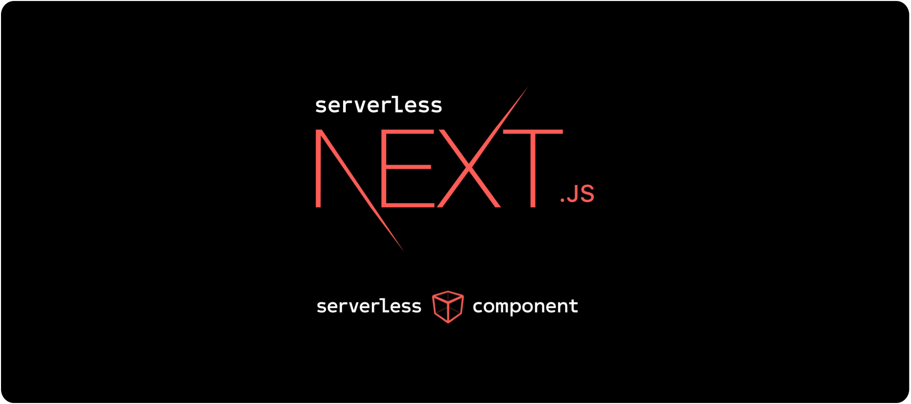
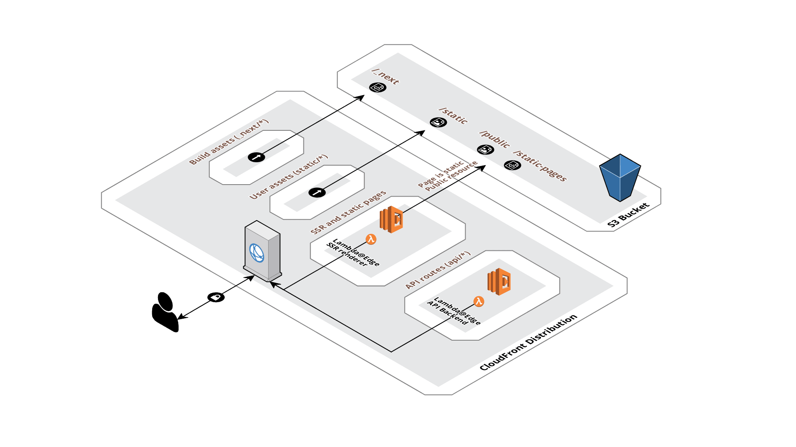

## Serverless Next.js Component

[Serverless Nextjs](https://serverless-nextjs.com/docs/)
[serverless-nextjs/serverless-next.js](https://github.com/serverless-nextjs/serverless-next.js)
[Serverless Nextjs Plugin](https://www.serverless.com/plugins/serverless-nextjs-plugin)

## Serverless.yml Reference

[Serverless.yml Reference](https://www.serverless.com/framework/docs/providers/aws/guide/serverless.yml)

## Next.js

[Next.js ドキュメント日本語翻訳サイト](https://nextjs-ja-translation-docs.vercel.app/docs/getting-started)
[Next.js Documentation](https://nextjs.org/docs/getting-started)

## デプロイ

```bash
serverless
```

## next.js/examples

[next.js/examples](https://github.com/vercel/next.js/tree/master/examples)

## はじめに

このプロジェクトは、[create-next-app](https://github.com/vercel/next.js/tree/canary/packages/create-next-app)で起動された[Next.js](https://nextjs.org/)プロジェクトです。

まず、開発サーバーを起動します。

```bash
npm run dev
# or
yarn dev
```

ブラウザで [http://localhost:3000](http://localhost:3000) を開き、結果を確認してください。

`pages/index.tsx`を修正することで、ページの編集を始めることができます。ファイルを編集すると、ページが自動更新されます。

[APIルート](https://nextjs.org/docs/api-routes/introduction)は、[http://localhost:3000/api/hello](http://localhost:3000/api/hello) でアクセスできます。このエンドポイントは`pages/api/hello.ts`で編集できます。

`pages/api`ディレクトリは、`/api/*`にマッピングされています。このディレクトリ内のファイルは、Reactページではなく、[APIルート](https://nextjs.org/docs/api-routes/introduction)として扱われます。


## さらに詳しく

Next.jsについて詳しく知りたい方は、以下のリソースをご覧ください。

- [Next.js ドキュメント](https://nextjs.org/docs) - Next.jsの機能やAPIについて説明しています。
- [Learn Next.js](https://nextjs.org/learn) - Next.jsのインタラクティブなチュートリアルです。

[Next.jsのGitHubリポジトリ](https://github.com/vercel/next.js/)をチェックすることができます。あなたのフィードバックや貢献を歓迎します。

## Vercelでのデプロイ

Next.jsのアプリをデプロイする最も簡単な方法は、Next.jsの開発者が提供する[Vercelプラットフォーム](https://vercel.com/new?utm_medium=default-template&filter=next.js&utm_source=create-next-app&utm_campaign=create-next-app-readme)を利用することです。

詳細は、[Next.jsのデプロイメントドキュメント](https://nextjs.org/docs/deployment)をご覧ください。

## Serverless Next.js Component



[](https://www.serverless.com)
[](https://github.com/serverless-nextjs/serverless-next.js/graphs/contributors)
[](https://opencollective.com/serverless-nextjs-plugin)
[](https://www.npmjs.com/package/@sls-next/serverless-component?activeTab=versions)
[](https://www.npmjs.com/package/@sls-next/serverless-component?activeTab=versions)


[](https://www.codacy.com/gh/serverless-nextjs/serverless-next.js/dashboard?utm_source=github.com&amp;utm_medium=referral&amp;utm_content=serverless-nextjs/serverless-next.js&amp;utm_campaign=Badge_Grade)
[](https://codecov.io/gh/serverless-nextjs/serverless-next.js)

[](https://www.cypress.io/)


AWS Lambda@Edge用のゼロコンフィグレーションのNext.js 10/11 [サーバーレスコンポーネント](https://github.com/serverless-components/)で、フル機能パリティを目指しています。

現在サポートされている機能の一覧は、[機能](https://github.com/serverless-nextjs/serverless-next.js#features)をご覧ください。

## コンテンツ

- [動機](#motivation)
- [設計方針](#design-principles)
- [機能一覧](#features)
- [はじめに](#getting-started)
- [Lambda@Edgeの設定](#lambda-at-edge-configuration)
- [カスタムドメイン名](#custom-domain-name)
- [CloudFrontのカスタム設定](#custom-cloudfront-configuration)
- [静的ページのキャッシング](#static-pages-caching)
- [パブリックディレクトリのキャッシング](#public-directory-caching)
- [AWSパーミッション](#aws-permissions)
- [アーキテクチャ](#architecture)
- [入力項目](#inputs)
- [CDKコンストラクト](#cdk-construct)
- [FAQ](#faq)

> :警告 この README は `master` ブランチの最新の変更を反映しています。npmの`latest`（stable版）または`alpha`版のリリースにまだ公開されていないかもしれません。[Releases](https://github.com/serverless-nextjs/serverless-next.js/releases)にアクセスして、使用している`@sls-next/serverless-component`の正しいバージョンを見つけ、そのリリースのREADMEを開いてより正確な情報を得てください。このREADMEに記載されている機能が動作しない場合は、まずnpmの最新の`alpha`リリースにアップグレードしてみてください。

> ⚠ このプロジェクトはGA以前に開始されたため、現在はServerless Components Beta (GA版ではない)を使用しています。現在、将来のデプロイ方法を再検討しており、CDKやCDK for Terraformなどのより良いIaCソリューションを検討しており、更新があれば年内に発表します。

### 動機

Next.js 8.0以降、[serverless mode](https://nextjs.org/blog/next-8#serverless-nextjs)が導入され、このようなプロジェクトがさまざまなクラウドプロバイダーにデプロイするために使用できる新しい低レベルAPIが提供されました。しかし、Next.jsは完全なサーバーレス・ルーティング・ロジックを提供していないため、そのギャップを埋めるためにこのプロジェクトが必要になりました。長期的なビジョンとしては、AWSをはじめとするさまざまなクラウドでセルフホストができるようにすることです。

このプロジェクトは、[serverless plugin](https://github.com/serverless-nextjs/serverless-next.js/tree/master/packages/deprecated/serverless-plugin)の改良版で、[next 9のサポート](https://github.com/serverless-nextjs/serverless-next.js/issues/101)、[より良い開発体験](https://github.com/serverless-nextjs/serverless-next.js/issues/59)、[200 CloudFormationのリソース制限](https://github.com/serverless-nextjs/serverless-next.js/issues/17)、[パフォーマンス](https://github.com/serverless-nextjs/serverless-next.js/issues/13)などのコアな問題を解決することに重点を置いています。

### 設計方針

1. デフォルトでは設定不要

設定はほとんど必要ありません。アプリケーションのニーズに応じてデフォルトを拡張することができます。

2. Next.jsとの機能的同等性

このコンポーネントのユーザーは、Next.jsの開発ツール、通称`next dev`を使用できるはずです。このコンポーネントは、私たちが知っているnextのすべての機能との同等性を確保しながら、アプリケーションをデプロイするのが仕事です。Next.jsのルーティングやサーバーサイドのロジックのすべて、またはほとんどをエミュレートして、サーバーレス環境に最適化するようにしています。以下に、現在サポートされている機能の一覧を示します。

3. 高速なデプロイメント／CloudFormationのリソース制限なし。

シンプルなアーキテクチャでCloudFormationを使用しないため、アプリケーションのページ数に制限がなく、デプロイ時間も非常に高速です！もちろん、CloudFrontの伝搬時間は例外です。

### 機能一覧

Next.jsのルーティングロジックをエミュレートしているため、残念ながら常に完全に一致しているわけではありません。以下では、サポートされているすべての機能、または予定されている機能を示しています。チェックボックスにチェックが入っている場合は、その機能がサポートされていることを意味します。それ以外の場合は、まだサポートされていないか、現在計画中または実装段階であることを意味します。具体的な内容については、各項目の説明をご覧ください。

なお、一部の機能は最新の[アルファバージョン](https://www.npmjs.com/package/@sls-next/serverless-component?activeTab=versions)にしか搭載されていない場合があります。サポートされているが、`latest`のタグでは動作しないと記載されている機能は、ほとんどの場合、`alpha`タグに含まれています。可能であれば、最新のアルファ版の変更点のテストにご協力いただき、問題が見つかった場合は[バグレポートをご提出ください](https://github.com/serverless-nextjs/serverless-next.js/issues/new?assignees=&labels=&template=bug_report.md&title=)。ご協力ありがとうございます。

欲しいけれど、まだサポートされていない機能がありますか？[新しいissue](https://github.com/serverless-nextjs/serverless-next.js/issues/new?assignees=&labels=&template=feature_request.md&title=)を作成してお知らせください。

- [x] [サーバーサイドでレンダリングされたページをEdgeで](https://nextjs.org/docs/basic-features/data-fetching)。
      レンダリングにサーバーサイドのコンピュートが必要なページはLambda@Edgeでホストされます。コンポーネントがすべてのルーティングを行うので、設定は必要ありません。レンダリングはCloudFrontのエッジで行われるため、ロケーションのレイテンシーは非常に低くなっています。
- [x] [APIルート](https://nextjs.org/docs/api-routes/introduction)。
      サーバーサイドのレンダリングページと同様に、APIリクエストもLambda@Edgeを使ってCloudFrontのエッジロケーションから提供されます。
- [x] [ダイナミックページ / ルートセグメント](https://nextjs.org/docs/routing/dynamic-routes)。
- [x] [すべてのルートをキャッチ](https://nextjs.org/docs/routing/dynamic-routes#catch-all-routes)。
- [x] [自動プリレンダリング](https://nextjs.org/docs/advanced-features/automatic-static-optimization)。
      Nextで編集された静的に最適化されたページは、CloudFrontのエッジロケーションから低レイテンシー、低コストで提供されます。
- [x] [クライアントアセット](https://nextjs.org/docs/api-reference/next.config.js/cdn-support-with-asset-prefix)。
      Next.jsのビルドアセット `/_next/*` CloudFrontから提供されます。
- [x] [ユーザーのstatic / publicフォルダ](https://nextjs.org/docs/basic-features/static-file-serving)。
      staticフォルダやpublicフォルダにあるアセットは、自動的にS3にアップロードされ、CloudFrontから配信されます。
- [x] [静的生成（SSG）へのオプトイン](https://nextjs.org/docs/basic-features/data-fetching#getstaticprops-static-generation)  `getStaticProps`による。
- [x] [サーバーサイドレンダリング（SSR）へのオプトイン](https://nextjs.org/docs/basic-features/data-fetching#getserversideprops-server-side-rendering)  `getServerSideProps`による。
- [x] [動的ソースからルートセットを静的に生成](https://nextjs.org/docs/basic-features/data-fetching#getstaticpaths-static-generation)  `getStaticPaths`による。
- [x] [ベースパス](https://nextjs.org/docs/api-reference/next.config.js/basepath)
- [x] [プレビューモード](https://nextjs.org/docs/advanced-features/preview-mode)
- [x] [任意のキャッチオール・ルート](https://nextjs.org/docs/routing/dynamic-routes#optional-catch-all-routes)
- [x] [リダイレクト](https://nextjs.org/docs/api-reference/next.config.js/redirects)。警告: `_next/static/*`と`static/*`を除くすべてのルートがリダイレクトできるはずです。これらのキャッシュビヘイビアにはLambdaハンドラが付いていないからです。なお、新しい`has` matching format（https://nextjs.org/docs/api-reference/next.config.js/redirects#header-cookie-and-query-matching ）はまだサポートされていません。
- [x] [リライト](https://nextjs.org/docs/api-reference/next.config.js/rewrites)。警告: これは、`_next/static/*`と`static/*`を除くすべてのルートが書き換え可能であることを意味しています。なぜなら、これらのキャッシュビヘイビアにはLambdaハンドラが付いていないからです。なお、新しい `has` マッチングフォーマット(https://nextjs.org/docs/api-reference/next.config.js/redirects#header-cookie-and-query-matching)はまだサポートされていません。
- [x] [カスタムヘッダー](https://nextjs.org/docs/api-reference/next.config.js/headers)。警告: すべてのルートは、`_next/static/*` と `static/*` 以外のカスタムヘッダーを持つことができます。これらのキャッシュビヘイビアには Lambda ハンドラーが付いていないからです。なお、新しい `has` マッチングフォーマット (https://nextjs.org/docs/api-reference/next.config.js/redirects#header-cookie-and-query-matching) はまだサポートされていません。
- [x] [画像の最適化](https://nextjs.org/docs/basic-features/image-optimization)
- [x] [Next.js 10 ローカライゼーション](https://nextjs.org/blog/next-10)。詳細やヒントは、https://github.com/serverless-nextjs/serverless-next.js/issues/721 をご覧ください。また、`next-i18next`パッケージを使用している場合は、デフォルトの設定ファイルを自動的に検出してコピーします。
- [x] [インクリメンタル・スタティック・リジェネレーション](https://nextjs.org/docs/basic-features/data-fetching#incremental-static-regeneration)。LambdaロールのSQS.SendMessageパーミッションと、デプロイユーザーの様々なSQS/Lambdaパーミッションが必要です（注意：既存のアプリにISRを追加するには、今のところLambdaロールのパーミッションを手動で更新する必要があります - https://github.com/serverless-nextjs/serverless-next.js/issues/1510 参照）。詳細は https://github.com/serverless-nextjs/serverless-next.js/pull/1028 を参照してください。この素晴らしい仕事をしてくれた @kirkness に大感謝です。
- [ ] [Next.js 12の特徴](https://nextjs.org/blog/next-12) ミドルウェア、ボット対応ISRフォールバック、AVIF画像サポートなどの機能はまだサポートされていませんが、最新のコンポーネントバージョンを使用すれば、Next.js 12で既存の機能を使用することができます。

### はじめに

まず、すべてのコードがES2019にトランスパイルされているので、デプロイ先のマシンにNode.js 12+がインストールされていることを確認してください。次のアプリケーションをserverless.ymlに追加します。

```yml
# serverless.yml

myNextApplication:
  component: "@sls-next/serverless-component@{version_here}" # 最新の安定版のserverless-next.jsを使用することをお勧めします。
```

:no_entry_sign: **`serverless.yml`ファイルに`@sls-next/serverless-component`を指定した場合、package.jsonファイルに`@sls-next/serverless-component`を追加しないと、このタグは使用されず、`serverless.yml`ファイルに記載されているバージョンのみが使用され、Serverlessが勝手にnpmから引っ張ってきます。バージョンを指定しない場合は、[最新の安定版](https://www.npmjs.com/package/@sls-next/serverless-component)を指す`latest`タグが使用されます（アルファ版は使用されません）。**

また、`package.json`を使ってバージョン管理をしたい場合などは、ローカルのインストール先を指定することもできます。

この場合、以下のように設定します。

```yml
# serverless.yml

myNextApplication:
  component: "./node_modules/@sls-next/serverless-component"
```

そして、環境変数としてAWSの認証情報を設定します。

```bash
AWS_ACCESS_KEY_ID=accesskey
AWS_SECRET_ACCESS_KEY=sshhh
```

そして、シンプルにデプロイする。

```bash
$ serverless
```

[ALPHA - バグがあるかもしれません] `npx @sls-next/serverless-patched`（ローカルでインストールした場合は`serverless-patched`）を使ってデプロイすることもできます。これは、基盤となる`@serverless/cli`にパッチを当てることでいくつかの問題を修正した`serverless`のパッチ版で、(1)継続的な「Deploying」メッセージが非インタラクティブ端末（CI出力など）に表示され、デバッグが困難になる、(2)Next.jsのサイレントビルド失敗を処理する、などの問題があります。

また、舞台裏で何が起こっているのか、より有用なログを得るために `--debug` フラグを追加することをお勧めします。

:no_entry_sign: **`serverless deploy`を実行してデプロイしようとせず、`serverless`のみを使用します。**

### カスタムドメイン名

ほとんどの場合、アプリケーションへのアクセスにCloudFrontの配信ドメインを使用したくないでしょう。その代わりに、カスタムドメイン名を指定することができます。

任意のドメイン名を使用することができますが、DNSホスティングにAWS Route53を使用する必要があります。既存のドメインからDNSレコードを移行するには、[こちら](https://docs.aws.amazon.com/Route53/latest/DeveloperGuide/MigratingDNS.html)の手順に従ってください。カスタムドメイン名を使用するための要件です。

- Route53には、ネームサーバーのセットを持つお客様のドメイン（例：`mydomain.com`）のホストゾーンを含める必要があります。
- ドメイン名レジストラ（namecheap、godaddyなど）に登録されているネームサーバーを、新しいホストゾーンに提供されているものに更新する必要があります。

サーバーレスのNext.jsコンポーネントは、自動的にSSL証明書を生成し、CloudFrontディストリビューションを指す新しいレコードを作成します。

```yml
# serverless.yml

myNextApplication:
  component: "@sls-next/serverless-component@{version_here}"
  inputs:
    domain: "example.com" # サブドメインのデフォルトはwww
    domainMinimumProtocolVersion: "TLSv1.2_2018" # 省略可能、デフォルトは "TLSv1.2_2018"
```

また、`サブドメイン`の設定も可能です。

```yml
# serverless.yml

myNextApplication:
  component: "@sls-next/serverless-component@{version_here}"
  inputs:
    domain: ["sub", "example.com"] # [ sub-domain, domain ]
```

### カスタムCloudFront設定

独自のCloudFront inputsを指定するには、`cloudfront`の下に任意の[aws-cloudfront inputs](https://github.com/serverless-nextjs/serverless-next.js/tree/master/packages/serverless-components/aws-cloudfront#3-configure)を追加するだけです。

```yml
# serverless.yml

myNextApplication:
  component: "@sls-next/serverless-component@{version_here}"
  inputs:
    cloudfront:
      # 既存のcloudfrontディストリビューションを使用したい場合は、ここでそれを提供します。
      distributionId: XYZEXAMPLE #任意
      # これは、cloudfront ディストリビューションのデフォルトのキャッシュ動作です。
      # このキャッシュビヘイビアに関連付けられたオリジン・リクエスト・エッジ・ラムダが、ページのサーバーサイドレンダリングを行います。
      defaults:
        forward:
          headers:
            [
              CloudFront-Is-Desktop-Viewer,
              CloudFront-Is-Mobile-Viewer,
              CloudFront-Is-Tablet-Viewer
            ]
      # これはnext.jsのapiページのキャッシュ動作です。
      api:
        minTTL: 10
        maxTTL: 10
        defaultTTL: 10
      # 上記の "defaults"のように、サーバーサイドレンダリングを処理できる他のキャッシュビヘイビアを設定することができます。
      # しかし、より具体的には、next.jsページのサブセットを対象としています。
      /blog/*:
        minTTL: 1000
        maxTTL: 1000
        defaultTTL: 1000
        forward:
          cookies: "all"
          queryString: false
      /about:
        minTTL: 3000
        maxTTL: 3000
        defaultTTL: 3000
      # Cloudfrontのディストリビューションにカスタムオリジンを追加することができます。
      origins:
        - url: /static
          pathPatterns:
            /wp-content/*:
              minTTL: 10
              maxTTL: 10
              defaultTTL: 10
        - url: https://old-static.com
          pathPatterns:
            /old-static/*:
              minTTL: 10
              maxTTL: 10
              defaultTTL: 10
        - url: http://old-api.com
          protocolPolicy: http-only
          pathPatterns:
            /old-api/*:
              minTTL: 10
              maxTTL: 10
              defaultTTL: 10
      aliases: ["foo.example.com", "bar.example.com"]
      priceClass: "PriceClass_100"
      # カスタムエラーレスポンスを追加することができます。
      errorPages:
        - code: 503
          path: "/503.html"
          minTTL: 5 # オプションで、エラーをキャッシュする最小のttlを指定します (デフォルトは10)
          responseCode: 500 # オプションで、レスポンスコードを変更する
      comment: "a comment" # 任意、あなたのディストリビューションを説明
      webACLId: "arn:aws:wafv2:us-east-1:123456789012:global/webacl/ExampleWebACL/473e64fd-f30b-4765-81a0-62ad96dd167a" # WAFのARN
      restrictions:
        geoRestriction:
          restrictionType: "blacklist" # 有効な値は、ホワイトリスト/ブラックリスト/noneです。"none"に設定して項目を省略すると、制限が無効になります。
          items: ["AA"] # ISO 3166 alpha-2 国コード
      certificate:
        cloudFrontDefaultCertificate: false # sfalseを指定してIAM/ACM証明書のいずれかを指定するか、trueを指定してデフォルト証明書のIAM/ACM入力を省略する。
        acmCertificateArn: "arn:aws:acm:us-east-1:123456789012:certificate/12345678-1234-1234-1234-123456789012"
        iamCertificateId: "iam-certificate-id" # ACM証明書またはIAM証明書のいずれかを指定し、両方を指定することはできません。
        sslSupportMethod: "sni-only" # 省略可能、デフォルトは "sni-only "です。
        minimumProtocolVersion: "TLSv1.2_2019" # 省略可能、デフォルトは "TLSv1.2_2019"
      originAccessIdentityId: XYZEXAMPLE #任意
      paths: ["/*"] # デプロイ時にどのパスを無効にするか。デフォルトはすべてにマッチし、空の配列は無効化を完全にスキップします。
      waitBeforeInvalidate: true # デフォルトのtrueでは、古いページのキャッシュを避けるために、CloudFrontの配信が完了するのを待ってから無効にします。
      tags: # お好きなタグを追加
        tag1: val1
        tag2: val2
```

これは、Next.jsのページをCloudFrontのエッジロケーションでキャッシュする場合に特に有効です。カスタムキャッシュの設定を行ったアプリケーションの例は[こちら](https://github.com/serverless-nextjs/serverless-next.js/tree/master/packages/serverless-components/nextjs-component/examples/app-with-custom-caching-config)をご覧ください。

また、カスタムcloudfront inputsを使用して、[既存のcloudfrontディストリビューションを更新する](https://github.com/serverless-nextjs/serverless-next.js/tree/master/packages/serverless-components/aws-cloudfront#updating-an-existing-cloudfront-distribution)こともできます。

### 静的ページのキャッシング

静的にレンダリングされたページ（S3にアップロードされたHTMLページなど）には、以下のCache-Controlが設定されています。

```
cache-control: public, max-age=0, s-maxage=2678400, must-revalidate
```

`s-maxage`は、Cloudfrontがエッジロケーションのページを31日間キャッシュすることを許可します。
`max-age=0`と`must-revalidate`を組み合わせることで、ブラウザが静的ページをキャッシュしないようにします。これにより、CloudfrontはキャッシュのTTLを完全にコントロールすることができます。すべてのデプロイメントで無効化`/*`が作成され、ユーザーが新鮮なコンテンツを得られるようになっています。

### パブリックディレクトリのキャッシュ

デフォルトでは、`/public` または `/static` フォルダーの一般的な画像フォーマット (`gif|jpe?g|jp2|tiff|png|webp|bmp|svg|ico`) には、1年間の `Cache-Control` ポリシー (`public, max-age=31536000, must-revalidate`) が適用されます。`publicDirectoryCache`では、`Cache-Control`ヘッダの`値`と、`テスト`するファイルの正規表現をカスタマイズすることができます。

```yaml
myNextApplication:
  component: "@sls-next/serverless-component@{version_here}"
  inputs:
    publicDirectoryCache:
      value: public, max-age=604800
      test: /\.(gif|jpe?g|png|txt|xml)$/i
```

`value` には有効な `Cache-Control` ポリシーを、`test` にはテストしたいファイルの種類を示す有効な`正規表現`を指定してください。公開ディレクトリのアセットをブラウザにキャッシュさせたくない場合は、これを無効にすることができます。

```yaml
myNextApplication:
  component: "@sls-next/serverless-component@{version_here}"
  inputs:
    publicDirectoryCache: false
```

### AWSパーミッション

デフォルトでは、Lambda@Edge関数はAWSLambdaBasicExecutionRoleを使って実行され、CloudWatchへのログのアップロードのみが許可されています。これ以上のパーミッションが必要な場合、例えばDynamoDBやその他のAWSリソースへのアクセスなど、独自のカスタムポリシーやロールARNが必要になります。

#### ポリシーの指定

```yml
# serverless.yml

myNextApplication:
  component: "@sls-next/serverless-component@{version_here}"
  inputs:
    policy: "arn:aws:iam::123456789012:policy/MyCustomPolicy"
```

#### ロールの指定

```yml
# serverless.yml

myNextApplication:
  component: "@sls-next/serverless-component@{version_here}"
  inputs:
    roleArn: "arn:aws:iam::123456789012:role/MyCustomLambdaRole"
```

カスタムポリシーやロールにCloudWatchのログパーミッションが追加されていることを確認してください。最小限のポリシーのJSON例。

```json
{
  "Version": "2012-10-17",
  "Statement": [
    {
      "Effect": "Allow",
      "Resource": "*",
      "Action": [
        "logs:CreateLogGroup",
        "logs:CreateLogStream",
        "logs:PutLogEvents"
      ]
    },
    {
      "Effect": "Allow",
      "Resource": "arn:aws:s3:::s3-deployment-bucket-name/*",
      "Action": ["s3:GetObject", "s3:PutObject"]
    }
  ]
}
```

ロールには、`lambda.amazonaws.com`および`edgelambda.amazonaws.com`との信頼関係が含まれている必要があります。

**NOTE**: `バケット名`を指定し、`ポリシー`や`roleArn`でそのバケットにアクセスする権限を与えることで、デフォルトやAPIラムダが静的リソースにアクセスできるようになります。

### デプロイメントのためのAWSパーミッション

デプロイメントに必要なAWSのアクションの網羅的なリストです。

```
  "acm:DescribeCertificate", // カスタムドメインの場合のみ
  "acm:ListCertificates",    // カスタムドメインの場合のみ
  "acm:RequestCertificate",  // カスタムドメインの場合のみ
  "cloudfront:CreateCloudFrontOriginAccessIdentity",
  "cloudfront:CreateDistribution",
  "cloudfront:CreateInvalidation",
  "cloudfront:GetDistribution",
  "cloudfront:GetDistributionConfig",
  "cloudfront:ListCloudFrontOriginAccessIdentities",
  "cloudfront:ListDistributions",
  "cloudfront:ListDistributionsByLambdaFunction",
  "cloudfront:ListDistributionsByWebACLId",
  "cloudfront:ListFieldLevelEncryptionConfigs",
  "cloudfront:ListFieldLevelEncryptionProfiles",
  "cloudfront:ListInvalidations",
  "cloudfront:ListPublicKeys",
  "cloudfront:ListStreamingDistributions",
  "cloudfront:UpdateDistribution",
  "cloudfront:TagResource",         // タグ追加用
  "cloudfront:UntagResource",       // タグ追加用
  "cloudfront:ListTagsForResource", // タグ追加用
  "iam:AttachRolePolicy",
  "iam:CreateRole",
  "iam:CreateServiceLinkedRole",
  "iam:GetRole",
  "iam:PutRolePolicy",
  "iam:PassRole",
  "lambda:CreateFunction",
  "lambda:EnableReplication",
  "lambda:DeleteFunction",            // カスタムドメインの場合のみ
  "lambda:GetFunction",
  "lambda:GetFunctionConfiguration",
  "lambda:PublishVersion",
  "lambda:UpdateFunctionCode",
  "lambda:UpdateFunctionConfiguration",
  "lambda:ListTags",                  // ラムダへのタグ付け
  "lambda:TagResource",               // ラムダへのタグ付け
  "lambda:UntagResource",             // ラムダへのタグ付け
  "route53:ChangeResourceRecordSets", // カスタムドメインの場合のみ
  "route53:ListHostedZonesByName",
  "route53:ListResourceRecordSets",   // カスタムドメインの場合のみ
  "s3:CreateBucket",
  "s3:GetAccelerateConfiguration",
  "s3:GetObject",                     // CI/CDのためにS3に状態を保持する場合のみ
  "s3:ListBucket",
  "s3:PutAccelerateConfiguration",
  "s3:PutBucketPolicy",
  "s3:PutObject",
  "s3:PutBucketTagging",              // バケットへのタグ付け
  "s3:GetBucketTagging",              // バケットへのタグ付け
  "lambda:ListEventSourceMappings",
  "lambda:CreateEventSourceMapping",
  "iam:UpdateAssumeRolePolicy",
  "iam:DeleteRolePolicy",
  "sqs:CreateQueue", // Incremental Static Regeneration を使用する場合にのみ必要な SQS パーミッション。Lambdaロールに必要な対応するSQS.SendMessageパーミッション
  "sqs:DeleteQueue",
  "sqs:GetQueueAttributes",
  "sqs:SetQueueAttributes"
```

### エッジでのラムダの設定

**default**、**api**、**image**（Next.js Image Optimizationの場合）のエッジラムダには、デフォルトで512MBのメモリが割り当てられます。この値は、`memory` inputに数値を割り当てることで変更できます。

```yml
# serverless.yml

myNextApplication:
  component: "@sls-next/serverless-component@{version_here}"
  inputs:
    memory: 1024
```

**default**、**api**、**image**の各ラムダの値は、次のようにオブジェクトに`memory`を割り当てて個別に定義することができます。

```yml
# serverless.yml

myNextApplication:
  component: "@sls-next/serverless-component@{version_here}"
  inputs:
    memory:
      defaultLambda: 1024
      apiLambda: 2048
      imageLambda: 2048
```

Node.jsのランタイム（デフォルトではnodejs14.x）を指定する場合も、同じパターンです。

```yml
# serverless.yml

myNextApplication:
  component: "@sls-next/serverless-component@{version_here}"
  inputs:
    runtime:
      defaultLambda: "nodejs14.x"
      apiLambda: "nodejs14.x"
      imageLambda: "nodejs14.x" # Note that the sharp image library is built for Lambda Node.js 14.x, although it will likely work fine on other runtimes
```

同様に、デフォルトのタイムアウトは10秒です。カスタマイズするには次のようにします。

```yml
# serverless.yml

myNextApplication:
  component: "@sls-next/serverless-component@{version_here}"
  inputs:
    timeout:
      defaultLambda: 20
      apiLambda: 15
      imageLambda: 15
```

なお、Lambda@Edgeで使用できる最大のタイムアウトは30秒です。参照 https://docs.aws.amazon.com/AmazonCloudFront/latest/DeveloperGuide/lambda-requirements-limits.html

**default**、**api**、**image**のラムダにはカスタム名を設定することもできます。デフォルトが設定されていない場合は、[aws-lambda serverless component](https://github.com/serverless-components/aws-lambda)によってリソースIDが設定されます。

```yml
# serverless.yml

myNextApplication:
  component: "@sls-next/serverless-component@{version_here}"
  inputs:
    name:
      defaultLambda: fooDefaultLambda
      apiLambda: fooApiLambda
      imageLambda: fooImageLambda
```

4つ目の**regeneration**ラムダもあり、同様の設定が可能で、Incremental Static Regenerationに使用されます。ただし、Lamda@Edgeは使用せず、タイムアウトの設定を長くすることなどが可能です。

### アーキテクチャ



CloudFrontには4つのCache Behavioursが作られています。

最初の2つ`_next/*`と`static/*`は、リクエストをS3に転送します。

3つ目は、3種類のリクエストを処理するラムダ関数に関連付けられています。

1. サーバーサイドでレンダリングされたページ。`getInitialProps`メソッドを定義しているページはすべてこのレベルでレンダリングされ、レスポンスはすぐにユーザーに返されます。

2. 静的に最適化されたページ。nextであらかじめHTMLにコンパイルされたページへのリクエストは、S3に転送されます。

3. 公開されたリソース。`/robots.txt`、`/favicon.ico`、`/manifest.json`などのルートレベルのリソースへのリクエスト。これらはS3に転送されます。

2.と3.が最初にLambda@Edgeを経由しなければならないのは、ルートが`_next/*`や`static/*`のようなパターンに適合していないからです。また、CloudFrontは[1つの配信につき25個](https://docs.aws.amazon.com/AmazonCloudFront/latest/DeveloperGuide/cloudfront-limits.html#limits-web-distributions)までしか許可しないので、1つのルートに1つのキャッシュ動作というのは良くない。

4番目のキャッシュビヘイビアは、次のAPIリクエスト `api/*` を処理します。

### Inputs

| Name            | Type     | Default Value | Description                                                                                                                                                                                                                                                                                                                                                                      |
| --------------- | -------- | ------------- | -------------------------------------------------------------------------------------------------------------------------------------------------------------------------------------------------------------------------------------------------------------------------------------------------------------------------------------------------------------------------------- |
| deploy          | `boolean`  | `true`        | falseを設定すると、アプリをプロバイダ（例：AWS）にデプロイしません。                                                                                                                                                                                                                                                                                                                                         |
| domain          | `Array`  | `null`        | 例えば、`['admin', 'portal.com']`                                                                                                                                                                                                                                                                                                                                            |
| domainRedirects | `object` | `{}`          | 308リダイレクトを使って、エッジにドメインレベルのリダイレクトを追加します。ドメイン名→リダイレクト先のオブジェクトをプロトコルで指定します。例えば、`www.example.com: https://example.com`。詳しくは[こちら](https://github.com/serverless-nextjs/serverless-next.js#i-was-expecting-for-automatic-subdomain-redirection-when-using-the-domaintype-wwwapex-input)をご覧ください。
| bucketName      | `string` | `null`        | 静的アセットが保存されるカスタムバケット名。デフォルトでは自動生成されます。                                                                                                                                                                                                                                                                                                  |
| bucketRegion    | `string` | `null`        | S3バケットをホストする地域。CloudFrontがS3へのリクエストをプロキシする際のレイテンシーを軽減するために、エンドユーザーの大部分に近い地域であることを確認してください。                                                                                                                                                                                               |
| bucketTags      | `object` | `undefined`   | あなたのバケットに設定するカスタムバケットタグ。未定義の場合、コンポーネントはどのタグも更新しません。空のオブジェクトに設定すると、すべてのタグを削除します。                                                                                                                                                                                                                             |
| nextConfigDir | `string` | `./` | あなたのアプリケーション`next.config.js`ファイルがあるディレクトリ。この入力は、`serverless.yml`がnext appと同じディレクトリにない場合に便利です。 <br>**注意:** `next.config.js`の`distDir`が使用されている場合は`nextConfigDir`を設定する必要があります。 |
| nextStaticDir | `string` | `./` | `static`ディレクトリや`public`ディレクトリが `nextConfigDir` の直接の子ではない場合、これが必要です。 |
| description | `string` | `*lambda-type*@Edge for Next CloudFront distribution` | 両方のラムダに使用される説明です。API ラムダの説明には "(API)" が付加されることに注意してください。 |
| policy | `string\|object` | `arn:aws:iam::aws:policy/service-role/AWSLambdaBasicExecutionRole` | 両方のラムダに割り当てられるarnまたはインラインのポリシーです。 |
| roleArn | `string\|object` | null | 両方のラムダに割り当てられるロールのarnです。 |
| runtime | `string\|object` | `nodejs14.x` | 値を指定すると、defaultとapiラムダの両方に、その値で定義されたランタイムが割り当てられます。オブジェクトに割り当てられた場合、defaultとapiラムダの値は別々に定義できます。 |
| memory | `number\|object` | `512` | 数字が割り当てられた場合、デフォルトラムダとapiラムダの両方にその値のメモリが割り当てられます。オブジェクトに割り当てられた場合、defaultとapiラムダの値は別々に定義できます。 |
| tags | `object` | `undefined` | ラムダに割り当てるタグです。未定義の場合、コンポーネントはどのタグも更新しません。空のオブジェクトに設定すると、すべてのタグを削除します。 |
| timeout | `number\|object` | `10` | 同上 |
| handler | `string` | `index.handler` | 値を指定すると、デフォルトの関数ハンドラをオーバーライドして設定できるようにします。`handler.js`をLambdaのフォルダにコピーします。ハンドラーはその後も`default-handler`を呼び出さなければなりません。 |
| name | `object` | / | すべてのラムダの名前を明示的に定義することができます。 |
| build | `boolean\|object` | `true` | trueの場合はアプリをビルドしてデプロイし、falseの場合はアプリがビルドされたと仮定して、`nextConfigDir`にある`.next` `.serverless_nextjs`ディレクトリを使ってデプロイします。オブジェクトが`build`に渡された場合、どのスクリプトがどのような引数で呼び出されるかをオーバーライドすることができます。 |
| build.cmd | `string` | `node_modules/.bin/next` | Buildコマンドにno-opコマンド（Unixベースのシステムでは`true`や `:` など）を渡すことで、Next.jsのビルドをスキップすることができます。 |
| build.args | `Array\|string` | `['build']` | ビルドに渡すArguments |
| build.cwd | `string` | `./` | 現在の作業ディレクトリを上書きする |
| build.enabled | `boolean` | `true` | `build:false`を渡した場合と同じですが、コンフィグ内では |
| build.env | `object` | `{}` | スクリプトへの環境変数の追加 |
| build.postBuildCommands | `Array` | `[]` | ポストビルドやプリデプロイで実行する任意のコマンド。例えば、`.serverless_nextjs`ディレクトリ上で任意のカスタムコードを実行することができます。例えば、Lambdaに追加ファイルをコピーすることができます。`next-18n`の例については、https://github.com/serverless-nextjs/serverless-next.js/issues/767#issuecomment-722967719 を参照してください。`serverless`コマンドの実行中のみ適用されます。 |
| build.cleanupDotNext | `boolean` | `true` | ビルドステップを実行する前に、`.next`ディレクトリをクリーンアップするかどうか |
| build.assetIgnorePatterns | `string[]` | `[]` | next/static, public, static ディレクトリからコピーするファイルを検出する際に無視するGlobパターン。 |
| build.useV2Handler | `boolean` | `false` | **実験** これを true に設定すると、V2 ハンドラを使用するようになり、汎用化されたハンドラの使用を開始します。注意: これは `separateApiLambda` と `disableOriginResponseHandler` の機能を持っているので、一緒に使うべきではありません。また、コードサイズの点ではまだ完全に最適化されていませんが、それでもパフォーマンスは高いはずです。将来的には、このモードをデフォルトで使用することになるでしょう。 |
| cloudfront | `object` | `{}` | [aws-cloudfront](https://github.com/serverless-components/aws-cloudfront)に渡される入力内容  |
| certificateArn | `string` | `` | CloudFrontの配信に使用する特定の証明書ARN。使用したいワイルドカードSSL証明書がある場合に便利です。この機能は現在、`domain` inputと連動しています。`domain` inputを使用せずに`証明書`を指定する方法については、[CloudFrontのカスタム設定](https://github.com/serverless-nextjs/serverless-next.js#custom-cloudfront-configuration)を確認してください（そうすることで、`domain` inputによる証明書が上書きされることに注意してください）。 | 
| domainType |`string` |`"both"` | "apex" - apexドメインのみ、wwwサブドメインを作成しない。"www" - wwwドメインのみ、apexサブドメインを作成しない。"both" - wwwドメインとapexドメインのどちらかが提供された場合、両方を作成する。 | 
| domainMinimumProtocolVersion |`string` |`"TLSv1.2_2018"` | `"SSLv3", "TLSv1", "TLSv1.1_2016", "TLSv1.2_2018", "TLSv1.2_2019", "TLSv1.2_2021" or "TLSv1_2016"` のいずれかになります。 [参考](https://docs.aws.amazon.com/AWSCloudFormation/latest/UserGuide/aws-properties-cloudfront-distribution-viewercertificate.html)をご覧ください。 |
| publicDirectoryCache |`boolean\|object`|`true` | `public`/`static`フォルダのアセットキャッシングポリシーをカスタマイズします。オブジェクトに `value` と / または `test` を割り当てることで、キャッシュポリシーやキャッシュされるファイルの種類をカスタマイズできます。falseを指定すると、キャッシングが無効になります。 | 
| useServerlessTraceTarget |`boolean` |`false` | 次のアプリをビルドするには、experimental-serverless-traceターゲットを使用します。これは、Vercel Nowが使用しているビルドターゲットと同じです。詳細はこの[RFC](https://github.com/vercel/next.js/pull/8246) を参照してください。注：このターゲットを使用する際には、`NODE*ENV`変数を`production`に設定する必要がある場合があります。 | 
| logLambdaExecutionTimes | `boolean` |`false` | デフォルト・ハンドラのパフォーマンス・メトリクスをCloudWatchに記録します。 | 
| minifyHandlers |`boolean` |`false` | コードサイズを小さくするために、事前に作成されたミニ化されたハンドラーを使用します。カスタムハンドラーのミニマイズは行いません。 | 
| deploy |`boolean` |`true` | リソースをAWSにデプロイするかどうか（最新のアルファ版で利用可能）。ビルドアウトプット（Lambdasとassets）が必要なだけで、自分でデプロイしたい場合に便利です。ビルド出力は`.serverless_nextjs`ディレクトリに作成されます。あとは自分でAWSの設定を行うことになります。CloudFrontのビヘイビアをLambda関数に関連付けて設定したり、アセットを適切な`Cache-Control`ヘッダーでS3にアップロードするなどです。 | 
| enableHTTPCompression |`boolean` |`false` | `true`に設定すると、SSRとAPIリクエスト用のLambda@Edge関数は、Gzipを使用してレスポンスを圧縮します。なお、CloudFrontがレスポンスを圧縮してくれるので、これを有効にする必要はありません。 | 
| authentication |`object` |`undefined` | Basic認証で使用する認証オブジェクトです（1.19.0-alpha.3から利用可能）。今のところ、1つのユーザー名とパスワードの組み合わせしかサポートしておらず、Lambdaハンドラーにプレーンテキストでインライン化されています。また、CloudFrontのビヘイビア（例：`defaults`, `api/*`, `\_next/data/\_`）にも`Authorization`ヘッダーを転送する必要があります。 **注：これは、開発/テストサイトなどの環境を保護するための簡単な手段であり、本番環境での使用は推奨されません。** | 
| authentication.username | `string` |`undefined` | Basic認証用のユーザー名です。 | 
| authentication.password |`string` |`undefined` | Basic認証のパスワード。 **注意：ここでパスワードを再利用しないことを強くお勧めします。Lambdaハンドラで平文でインライン化されてしまうからです。** | 
| enableS3Acceleration |`boolean` |`true` | S3の転送アクセラレーションを有効にするかどうか。AWSのリージョンによってはサポートしていないため、無効にしておくと便利です。[リファレンス](https://docs.amazonaws.cn/en_us/aws/latest/userguide/s3.html)を見てください。 |
| removeOldLambdaVersions | `boolean` | `false` | デプロイ後に古いLambdaのバージョンを確実に削除するための基本的なサポートです。trueに設定すると、デプロイするたびに、デプロイ/レプリケートされていないすべてのLambdaの古いバージョンを最大～50個（古いものから順に）自動的に削除します。より複雑な戦略が必要な場合は、古いバージョンを削除するスクリプトを自分で書くことが推奨されます。 |

カスタムinputsは以下のように設定できます。

```yaml
myNextApp:
  component: "@sls-next/serverless-component@{version_here}"
  inputs:
    bucketName: my-bucket
```

### CDKコンストラクト

> (実験的) - このコンストラクトをスピードアップし、サーバーレスロジックの一部を再利用するための作業が必要です。そのため、この構成は適宜変更される可能性があります。

[ドキュメントはこちらでご覧いただけます。](https://serverless-nextjs.com/docs/cdkconstruct)

### FAQ

#### どのくらいの生産性があるのでしょうか？

Next.jsのルーティングロジックをほぼゼロからエミュレートしてサーバーレス環境に最適化しているため、（前述のように）不完全な機能や欠落している機能があるかもしれません。しかし、大部分の機能はカバーしており、安定性を確保するためにユニットテストとエンドツーエンドテストを充実させています（例：10個以上のエンドツーエンドテストスイートを用意）。何人もの人が、スタートアップや個人のウェブサイトなどのためにこれを使っています。

クラウドプロバイダーの制限も適用されます。例えば、AWS Lambda@Edgeでは、コールドスタート、コードサイズの制限、1MBのレスポンスサイズの制限などがあります。もちろん、今のところは単一のプラットフォームに縛られています（AWS Lambda@Edge; さらに近日公開予定）

また、近い将来、より優れた Infrastructure as Code（IaC）ソリューション（CDK、CDK Terraform、Pulumiなど）を検討することで、デプロイメントプロセスの改善を続けています。

#### 私のコンポーネントがデプロイされません

`serverless.yml`が`serverless-components` (beta) フォーマットを使用していることを確認してください。[serverless components](https://serverless.com/blog/what-are-serverless-components-how-use/)は、同じCLIでアクセスできるにもかかわらず、オリジナルのserverless frameworkとは異なります。

:white_check_mark: **Do**

```yml
# serverless.yml
myNextApp:
  component: "@sls-next/serverless-component@{version_here}"

myTable:
  component: serverless/aws-dynamodb
  inputs:
    name: Customers
# other components
```

:no_entry_sign: **Don't**

```yml
# serverless.yml
provider:
  name: aws
  runtime: nodejs10.x
  region: eu-west-1

myNextApp:
  component: "@sls-next/serverless-component@{version_here}"

Resources: ...
```

正しいyamlでは、`provider`や`Resources`などを宣言していないことに注意してください。

デプロイについては、`serverless deploy`を実行しないでください。`serverless`を実行するだけで、`serverless.yml`ファイルで宣言されたコンポーネントがデプロイされます。

serverlessコンポーネントの詳細は[こちら](https://serverless.com/blog/what-are-serverless-components-how-use/)をご覧ください。

#### Lambda@Edgeのコードサイズが大きすぎる

APIハンドラーとデフォルトハンドラーのパッケージは別々にデプロイされますが、それぞれAWSごとに50MBのzipファイル、または250MBの非圧縮ファイルの制限があります - [ここ](https://docs.aws.amazon.com/lambda/latest/dg/gettingstarted-limits.html)と[ここ](https://docs.aws.amazon.com/AmazonCloudFront/latest/DeveloperGuide/lambda-requirements-limits.html)を参照してください。設計上、すべてのページルートには1つのLambda@Edge、すべてのAPIルートには1つのLambda@Edgeしかありません。これは、特に多くのAPIルートやSSRページなどがある場合、コードサイズの問題につながる可能性があります。

コードサイズの問題が発生する場合は、以下をお試しください。

- コードサイズの最適化：SSRページやAPIルートの依存関係を減らし、SSRページの数を少なくする（例：`getInitialProps()`や`getServerSideProps()`を使わない）。

- `minifyHandlers`入力を使用して、ハンドラコード自体を最小化します。これにより、ハンドラのサイズは ~500 kB から ~200 kB になります。

- 次のWebpack設定を`next.config.js`に追加することで、Terserを使用してサーバーサイドのコードを最小化/簡略化することができます。環境変数`NEXT_MINIMIZE`を使用して、SSRコードの最小化を指示します。これにより、ビルド時間が長くなり、コードが最小化されるため、CloudWatchのエラーをデバッグするのが難しくなる可能性があることに注意してください。

まず、`terser-webpack-plugin`をdependenciesに追加します。そして、`next.config.js`を更新します。

```js
const TerserPlugin = require("terser-webpack-plugin");
```

```js
webpack: (config, { buildId, dev, isServer, defaultLoaders, webpack }) => {
  if (isServer && !dev && process.env.NEXT_MINIMIZE === "true") {
    config.optimization = {
      minimize: true,
      minimizer: [
        new TerserPlugin({
          parallel: true,
          cache: true,
          terserOptions: {
            output: { comments: false },
            mangle: true,
            compress: true
          },
          extractComments: false
        })
      ]
    };
  }

  return config;
};
```

なお、APIルートを使用していない場合は、静的ページのプリレンダリングにのみ使用されるすべてのJSファイルがバンドルから自動的に削除されます。ただし、API ルートを使用している場合は、プレビュー モードに使用されている可能性があるため、削除されません。APIルートが使用されている場合でも、プレビューモードで使用されていないこれらのJSファイルを識別して削除する公式/非ハッカー的な方法はありません。しかし、必要に応じて、それらを手動で除外するための新しい入力を追加することができます。

- `serverless.yml`で`useServerlessTraceTarget`オプションを使用します。これにより、Next.jsは各ページに依存関係をバンドルせず（代わりに軽量ページを作成）、`serverless-next.js`は`node_modules`で単一の依存関係のセットを参照するようになります。

#### サーバーレスのデプロイに時間がかかり、次のようなメッセージでタイムアウトします。 "TimeoutError: Connection timed out after 120000ms"

これは、Lambda@Edgeのコードサイズの問題（解決策は上記を参照してください。[GitHubのIssue](https://github.com/serverless-nextjs/serverless-next.js/issues/611)）、またはネットワークのアップロード速度が遅いか、大きなLambdaパッケージをデプロイしようとしている場合のいずれかであると考えられます。

2つ目のケースでは、使用されている`aws-sdk`のnpmパッケージでは、デフォルトのタイムアウトが120秒になっています。今のところ、これは設定できませんが、近い将来、より長いタイムアウトをサポートするかもしれません（https://github.com/serverless/serverless/pull/937 と同様ですが、これは Serverless Components ではなく、Serverless Framework にのみ適用されます）。

#### SSRのページやAPIでHostヘッダーにアクセスすると、CloudFrontのディストリビューションや自分のドメイン名ではなく、S3のドメインが表示されます。

デフォルトでは、CloudFrontは`Host`ヘッダーをS3オリジンのホスト名に設定します。オリジンに`Host`ヘッダーを転送する必要があります。`api/*`キャッシュの動作のために転送するには、以下の例を参照してください。

```yml
myNextApplication:
  component: "@sls-next/serverless-component@{version_here}"
  inputs:
    cloudfront:
      api/*:
        forward:
          headers: [Host]
```

#### [serverless-plugin](https://github.com/serverless-nextjs/serverless-next.js/tree/master/packages/deprecated/serverless-plugin)とこのコンポーネントのどちらを使うべきでしょうか？

ユーザーは、`serverless-plugin`の代わりにこのコンポーネントを使用することをお勧めします。このコンポーネントは、serverlessプラグインから得た教訓をもとに構築・設計されています。

#### アプリ内で他のAWSサービスとやり取りするには？

DynamoDBと連動するTodoアプリケーションの例は、`examples/dynamodb-crud`をご覧ください。例題の全リストは[こちら](https://github.com/serverless-nextjs/serverless-next.js/tree/master/packages/serverless-components/nextjs-component/examples)でご覧いただけます。

#### [CI/CD] マルチステージデプロイメント / CIビルドのたびに新しいCloudFrontディストリビューションが作成されるようになりました。想定していなかったこと

残念ながら、Serverless Componentsの仕組み上（少なくともベータ版）、デプロイの状態はメインの`serverless`コマンドの外で同期する必要があります。そこで、以下のような解決策を試してみてください。

1. ソースコントロールでアプリケーションの状態をコミットする必要があります。つまり、`.serverless`ディレクトリの下のファイルです。これは複数のステージではうまくいかないのでお勧めできませんが。
2. あるいは、S3を使って`.serverless`のファイルを保存することもできます。例としては、[こちら](https://gist.github.com/hadynz/b4e190e0ce10e5811cb462920a9c678f)、[こちら](https://gist.github.com/dphang/7395ee09f6182f6b34f224660bed8e8c)（複数のserverless.ymlファイルを使用）、[こちら](https://github.com/serverless-nextjs/serverless-next.js/issues/328#issuecomment-655466654)（GitHub Actionsベース、複数の`serverless.yml`ファイルを使用）などがあります。
3. また、`distributionId` CloudFront inputを使って、デプロイ先の既存のCloudFrontディストリビューションを指定することもできます。

将来的には、適切なステージ管理をコンポーネント自体に組み込むことで、この問題を改善したいと考えています。

#### なぜこれがまだ Serverless Components Beta を使っているのか？ GAにアップグレードする予定はありますか？

このプロジェクトは、Serverless Componentsがベータ版のときにオリジナルの作者が始めたもので、残念ながらその直後にGA componentsがリリースされました。しかし、これはどんどん大きくなり、いくつかのサブコンポーネントはServerlessではメンテナンスされていないため、このモノレポにインポートされました。そして、アップグレードが困難になりました。

GAコンポーネントにアップグレードする計画がありましたが、いくつかの理由で保留になりました。

* アクティブなメンテナが一人しかおらず、Next.jsのパリティに追従してバグを修正するのが大変だったため。
* Serverless Components GAを分析したところ、メリットよりもデメリットの方が多いように思えます。コードや一時的な認証情報をServerlessインフラ上で構築する必要があるため、ベンダーロックインのリスクがあります（一方で、βコンポーネントはそうではありませんでした - 主に再利用可能なコンポーネントを提供していましたが、すべてはローカルで行われていました）。さらに、適切なIaC（Infrastructure-as-Code）ソリューションほどの設定性や堅牢性はなく、多くのコンポーネント（特にAWS以外のリソース）は十分にメンテナンスされていません。最後に、現在のデプロイメント・ロジックは非常に脆弱でカスタム・ライティングされており、クラウド・プロバイダーの新機能に対応するためには多くのメンテナンスが必要です。

現在、適切なIaCソリューション（Terraform用CDK、CDK、Pulumiなど）を検討しており、これに対処し、複雑なデプロイメントロジックのメンテナンスの負担を軽減することで、開発者の体験やNext.jsとの機能の同等性に集中できるようにしたいと考えています。

#### 他のプラットフォームへの展開の予定はありますか？

はい。Next.jsのルーティングロジックは、Lambda@Edge/CloudFrontのロジックと高度に結合していたことが大きな障害でした。しかし、コアロジックのほとんどを（`@sls-next/core`パッケージに）汎用化したので、ラッピングハンドラを作成し、プラットフォーム固有のクライアント（ページの取得や静的再生のトリガーなど）を実装し、デプロイヤーを作成するだけで、他のプラットフォームでも再利用できるようになっています。もしあなたが注意深く観察していたならば、API Gateway経由でLambdaのデプロイを行うための新しいパッケージ https://github.com/serverless-nextjs/serverless-next.js/tree/master/packages/libs/lambda に気付いたことでしょう。AzureやGoogle Cloudのような他のプラットフォームでも、すぐに利用できるようになるといいですね。

#### 私の lambda は `us-east-1` にデプロイされています。どうすれば別の地域にデプロイできますか？

Serverless Next.jsはリージョンレスです。設計上、`serverless-next.js`のアプリケーションは、世界中のすべてのCloudFrontエッジロケーションにデプロイされます。ラムダは`us-east-1`にしかデプロイされていないように見えるかもしれませんが、裏では他のすべてのリージョンに複製されています。

#### ビルドに追加の情報を渡す必要があります

`ビルド`に追加の引数や環境変数を渡すなどの高度なビルド設定については、以下のサンプルを参照してください。

```yml
# serverless.yml
myDatabase:
  component: MY_DATABASE_COMPONENT
myNextApp:
  component: "@sls-next/serverless-component@{version_here}"
  inputs:
    build:
      args: ["build", "custom/path/to/pages"]
      env:
        DATABASE_URL: ${myDatabase.databaseUrl}
```

#### 環境変数の連結がうまくいかない

環境変数を`${env.VARIABLE}-blah`のように他の文字列と連結しようとすると、Serverless frameworkは`${env.VARIABLE}`だけに解決するようです。

これはServerless Componentsのバグのようです。修正されているかもしれない最新のGAバージョンを使用していないことが原因かもしれません（残念ながらこれはまだComponents Betaのままです）。今のところ、ワークアラウンドは

1. 環境変数が重複することになりますが、連結せずに環境変数だけを指定してください。
2. https://github.com/serverless-nextjs/serverless-next.js/issues/530#issuecomment-680122810 に従って、まず`serverless.yml`の変数を設定し、その後に連結します。

```yml
stage: ${env.STAGE}
my-app:
  component: "@sls-next/serverless-component@1.18.0"
  inputs:
    domain:
      - "${stage}-front-end"
      - mydomain.com
```

#### domainType:www/apex の入力でサブドメインの自動リダイレクトを期待していたのですが。

新しい `domainRedirects` inputを、`Host` ヘッダーと `domainType: both`を転送する際に使用することで、リクエストを正しいドメインにリダイレクトすることができます。以下の設定例では、`www.example.com` のリクエストを `https://example.com` にリダイレクトしています。

```yml
next-app:
  component: "../../serverless-components/nextjs-component"
  inputs:
    cloudfront:
      defaults:
        forward:
          headers: [Host]
    domain: ["example.com"]
    domainType: "both"
    domainRedirects:
      www.example.com: https://example.com
```

これらはすべて、Lambda@Edgeのオリジンリクエストハンドラ内で行われます。これにより、`_next/static/*`や`/static/*`でリクエストをリダイレクトすることはできませんのでご注意ください。

それ以外の場合は、[ここ](https://simonecarletti.com/blog/2016/08/redirect-domain-https-amazon-cloudfront/#configuring-the-amazon-s3-static-site-with-redirect)で説明するS3バケットを使った手動での回避策を使用することもできます。要約すると、新しいS3バケットを作成し、サポートされているサブドメインタイプ（例：「www.example.com」または「example.com」）にリクエストをリダイレクトするために、静的なWebサイトホスティングを設定する必要があります。HTTPSリダイレクトをサポートするには、S3リダイレクトバケットをオリジンとするCloudFrontディストリビューションをセットアップする必要があります。最後に、新しく作成したCloudFrontディストリビューションをエイリアスのターゲットとして、Route 53に「A」レコードを作成する必要があります。

#### `build.env`で設定した環境変数がアプリに反映されない

定義された環境変数にアプリがアクセスできるようにするには、`next.config.js`を介して環境変数を公開する必要があります（概要は[こちら](https://nextjs.org/docs/api-reference/next.config.js/environment-variables)）。

次のような`serverless.yml`があれば

```yml
myApp:
  inputs:
    build:
      env:
        API_HOST: "http://example.com"
```

next.config.jsはこのようになります。

```js
module.exports = {
  env: {
    API_HOST: process.env.API_HOST
  }
};
```

#### 502 CloudFrontのディストリビューションにアクセスする際のエラー

以下のようなエラーが表示されることがあります。

```
502 ERROR
The request could not be satisfied.
The Lambda function returned invalid JSON: The JSON output is not parsable. We can't connect to the server for this app or website at this time. There might be too much traffic or a configuration error. Try again later, or contact the app or website owner.
If you provide content to customers through CloudFront, you can find steps to troubleshoot and help prevent this error by reviewing the CloudFront documentation.
Generated by cloudfront (CloudFront)
```

一般的には、レスポンスのサイズが大きすぎる場合に発生します。現在、Lambda@Edgeには、オリジンのリクエストハンドラーが返す1MBという制限があります。参照： https://docs.aws.amazon.com/AmazonCloudFront/latest/DeveloperGuide/lambda-generating-http-responses-in-requests.html#lambda-generating-http-responses-errors . 残念ながら、レスポンスのサイズを確実に小さくすること以外に回避策はないかもしれません。


#### ロケールの自動検出

CloudFrontの設定で`Accept-Language`ヘッダーを転送するようにしてください。そうしないと、ユーザーがどの言語を理解しているか、または好むかを判断できません。デフォルトでは転送されていますが、独自の設定で上書きした場合は、元に戻す必要があります。

#### サードパーティの統合

サードパーティのライブラリ(現在は`next-i18next`のみ)を使用していて、デフォルトのパスを使用している場合、いくつかのファイルをLambdaディレクトリにコピーする必要があるかもしれません。このコンポーネントは、デフォルトのファイルを検出して、コピーしようとします。ただし、カスタム設定をしている場合は、ファイルのコピーなどを行う`postBuildCommands`を自分で書く必要があるかもしれません。

詳しい情報や注意点については、[README](https://github.com/serverless-nextjs/serverless-next.js/blob/master/packages/libs/lambda-at-edge/src/build/third-party/README.md)を参照してください。

## 報告事項

新しい問題を[ここ](https://github.com/serverless-nextjs/serverless-next.js/issues)で開くことができます。問題を投稿する際には、まず[debugging wiki](https://github.com/serverless-nextjs/serverless-next.js/wiki/Debugging-Issues)で有用なヒントを得て、問題を再現できるだけの情報を含めるようにしてください。

セキュリティ上の脆弱性を報告する場合は、代わりに[security policy](https://github.com/serverless-nextjs/serverless-next.js/security/policy)に従ってください。

現在、コア・メンテナは一人（@dphang）しかおらず、一握りのコミュニティ・コントリビューターが、自由な時間にこのライブラリに貢献していることに留意してください。そのため、私たちの対応はベストエフォートであり、数日またはそれ以上かかる可能性があることをご理解いただければと思います。そのため、少なくとも問題のデバッグにご協力いただくか、できるだけ多くの情報をご提供いただければと思います。問題が長い間(数週間以上)検討されていない場合や、大きな問題であると思われる場合は、遠慮なくメンテナの名前を挙げていただければ、優先順位をつけて対応させていただきます。

## 貢献

コーディング、問題のトリアージやデバッグ、ドキュメントの作成、資金面でのサポートなど、貢献していただける方をお待ちしています。詳しくは[contributing](./CONTRIBUTING.md)ガイドをご覧ください。

## 貢献者

### コード提供者

このプロジェクトが存在するのは、貢献してくれるすべての人々のおかげです。[[Contribute](CONTRIBUTING.md)].

<a href="https://github.com/serverless-nextjs/serverless-next.js/graphs/contributors">

</a>

[contributors-img](https://contrib.rocks)で作成。

### 財務上の貢献者

私たちのコミュニティを維持するために、寄付をしてください。 [[Contribute](https://opencollective.com/serverless-nextjs-plugin/contribute)]

#### 個人の場合

<a href="https://opencollective.com/serverless-nextjs-plugin"></a>

#### 組織

あなたの組織でこのプロジェクトをサポートしてください。あなたのロゴがここに表示され、あなたのウェブサイトへのリンクが張られます。[[Contribute](https://opencollective.com/serverless-nextjs-plugin/contribute)]

<a href="https://opencollective.com/serverless-nextjs-plugin/organization/0/website"></a>
<a href="https://opencollective.com/serverless-nextjs-plugin/organization/1/website"></a>
<a href="https://opencollective.com/serverless-nextjs-plugin/organization/2/website"></a>
<a href="https://opencollective.com/serverless-nextjs-plugin/organization/3/website"></a>
<a href="https://opencollective.com/serverless-nextjs-plugin/organization/4/website"></a>
<a href="https://opencollective.com/serverless-nextjs-plugin/organization/5/website"></a>
<a href="https://opencollective.com/serverless-nextjs-plugin/organization/6/website"></a>
<a href="https://opencollective.com/serverless-nextjs-plugin/organization/7/website"></a>
<a href="https://opencollective.com/serverless-nextjs-plugin/organization/8/website"></a>
<a href="https://opencollective.com/serverless-nextjs-plugin/organization/9/website"></a>